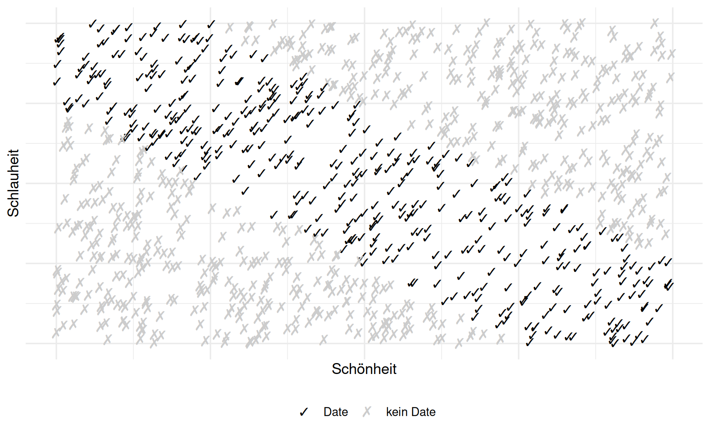
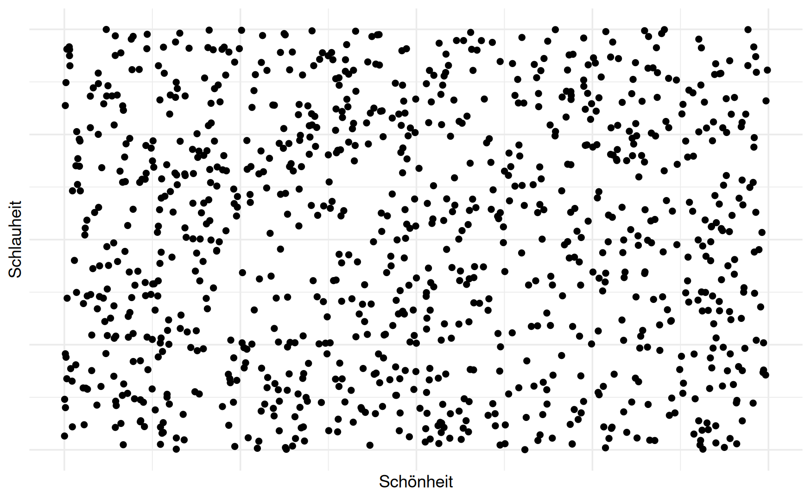

```{r}
library(tidyverse)
library(tinytable)
library(DT)
library(reactable)
library(knitr)
```


```{r}
focus_color = "black"
```


##  {.center}


::::: columns
::: {.column width="20%"}
[👨🏾‍🦰]{.r-fit-text}
Don
::::

:::: {.column width="80%"}
[Ich bin schön und schlau.]{.r-fit-text}

[Aber ich finde keine Frau!]{.r-fit-text}
::::
:::::


---


##  {.center}


::: columns
::: {.column width="20%"}
[👨🏾‍🦰]{.r-fit-text}
Don
:::

::: {.column width="80%"}
[Meine Dates sind entweder nur schön, oder nur schlau.]{.r-fit-text}

[Ich will beides!]{.r-fit-text}
:::
:::


---

## Ein Rendezvous, vier Möglichkeiten


```{r}
p_vierfelder <-
  ggplot() +
  # Achsen mit Pfeilen
  geom_segment(
    aes(x = -1.2, xend = 1.2, y = 0, yend = 0),
    arrow = arrow(length = unit(0.25, "cm")),
    linewidth = 0.7,
    color = focus_color
  ) +
  geom_segment(
    aes(x = 0, xend = 0, y = -1.2, yend = 1.2),
    arrow = arrow(length = unit(0.25, "cm")),
    linewidth = 0.7,
    color = focus_color
  ) +
  
  # Quadranten-Beschriftungen
  annotate("text", x =  0.6, y =  0.6, label = "schön: +\nschlau: +", color = focus_color) +
  annotate("text", x = -0.6, y =  0.6, label = "schön: -\nschlau: +", color = focus_color) +
  annotate("text", x =  0.6, y = -0.6, label = "schön: +\nschlau: -", color = focus_color) +
  annotate("text", x = -0.6, y = -0.6, label = "schön: -\nschlau: -", color = focus_color) +
  
  # Achsenlabels
  annotate("text", x = 1.25, y = -0.08, label = "Schönheit", hjust = 1, color = focus_color) +
  annotate("text", x = 0.05, y = 1.25, label = "Schlauheit", hjust = 1, angle = 90, color = focus_color) +
  
  coord_cartesian(xlim = c(-1.3, 1.3), ylim = c(-1.3, 1.3), clip = "off") +
  theme_void()


p_vierfelder
```


---

## Ein Rendezvous, vier Möglichkeiten

</br>
</br>


|                    | Schön +                 | Nicht schön -                  |
|--------------------|-------------------------|--------------------------------|
| **Schlau +**       | **schön und schlau**    | schlau und nicht schön         |
| **Nicht schlau -** | nicht schlau und schön  | **nicht schlau und nicht schön** |


---

## Die Schönen sind nicht schlau, und die Schlauen nicht schön?


{fig-align="center" width="60%"}

---

## Gott ist ... nicht ungerecht (?) 

</br>
</br>
  


---


## Die Schönen sind genauso schlau wie die Nicht-Schönen


{fig-align="center" width="60%"}


---

## Stellen Sie sich nach Schlauheit und Schönheit auf


```{r}
p_vierfelder
```


## Ziehen Sie einen Zettel für Schönheit und einen für Schlauheit


```{r}
schoen_schlau <-
  tibble(
    schoen = rnorm(30),
    schlau = rnorm(30),
    schoen_pr = percent_rank(schoen),
    schlau_pr = percent_rank(schlau)
  )
```


### Schönheit

```{r}

x <- round(schoen_schlau$schoen_pr, 2)
x <- format(x, nsmal = 2)
cat(
  ifelse(seq_along(x) %% 10 == 0,
         paste0(x, "\n"),
         paste0(x, " "))
)
```


### Schlauheit

